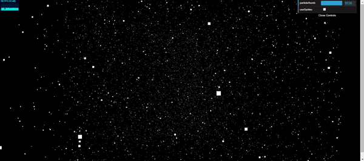
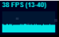
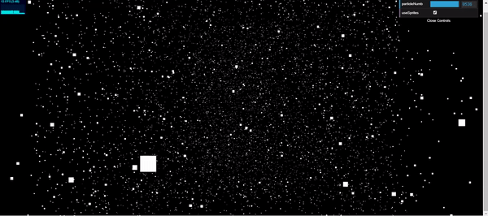
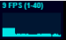

# Partikel, Sprites, dan Point Cloud

Repository ini berisi penggunaan particle, sprite, dan point cloud pada **three.js**

## Point Cloud vs Sprite

Perbedaan kinerja antara penggunaan point cloud dan sprite pada pergerakan particle dalam jumlah yang banyak

### Point Cloud

### Point Cloud FPS

### Sprite

### Sprite FPS

